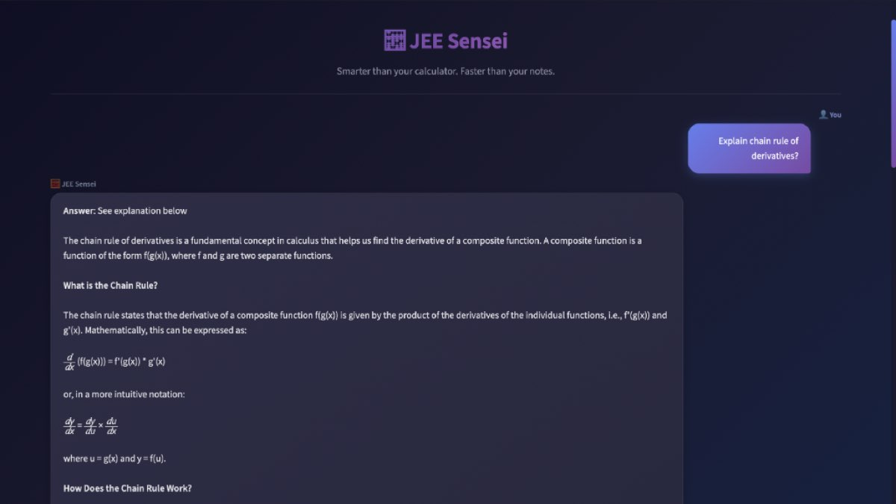
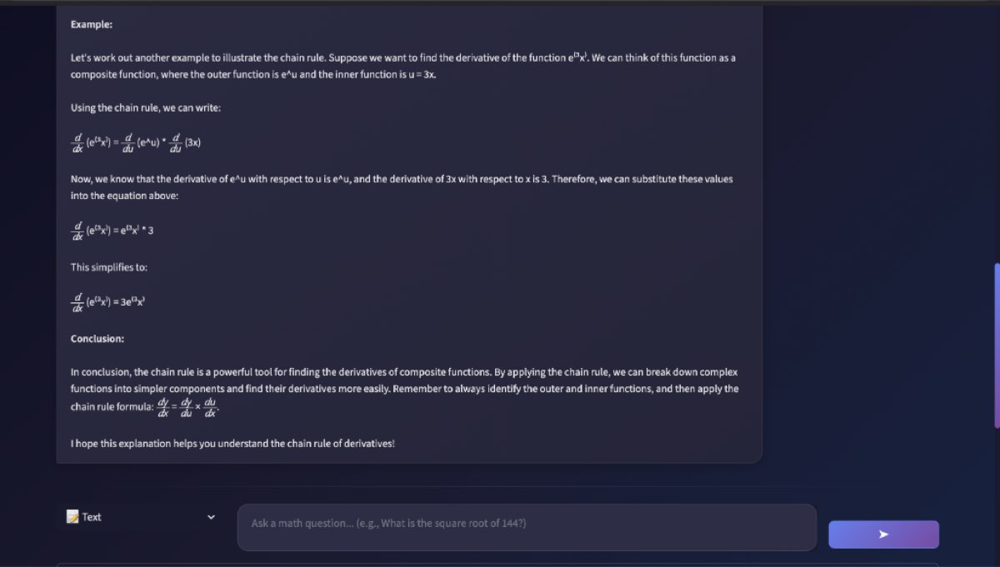

<p align="center">
  
</p>

<h1 align="center">🧮 JEE Sensei - AI Math Mentor</h1>

<p align="center">
  <strong>Smarter than your calculator. Faster than your notes.</strong>
</p>

<p align="center">
  <a href="https://jee-sensei.streamlit.app">
    
  </a>
  
  
  
</p>

---

## 🎯 Overview

**JEE Sensei** is an AI-powered math tutoring system designed specifically for JEE (Joint Entrance Examination) preparation. It uses a **multi-agent architecture** with **Retrieval-Augmented Generation (RAG)** to provide accurate, step-by-step solutions to complex mathematical problems.

### ✨ Key Features

- 🎤 **Multimodal Input** - Text, Voice (Whisper ASR), and Image (EasyOCR)
- 🧠 **Multi-Agent System** - Specialized agents for different math domains
- 📚 **RAG-Powered** - All solutions are backed by a curated knowledge base
- ✅ **Solution Verification** - SymPy-based mathematical verification
- 📊 **Confidence Scoring** - Transparency in solution reliability
- 💾 **Memory System** - Learns from previous interactions

---

## 📸 Screenshots

### Solution with Knowledge Sources
<p align="center">
  
</p>

### Step-by-Step Explanations
<p align="center">
  
</p>

<p align="center">
  
</p>

---

## 🏗️ Architecture

```
┌─────────────────────────────────────────────────────────────────┐
│                        USER INPUT                                │
│              (Text / Voice / Image)                              │
└──────────────────────────┬──────────────────────────────────────┘
                           │
                           ▼
┌─────────────────────────────────────────────────────────────────┐
│                     INPUT PROCESSING                             │
│         OCR (EasyOCR) │ ASR (Whisper) │ Text                    │
└──────────────────────────┬──────────────────────────────────────┘
                           │
                           ▼
┌─────────────────────────────────────────────────────────────────┐
│                     INTENT ROUTER                                │
│         Classifies: Algebra │ Calculus │ Probability │ Systems  │
└──────────────────────────┬──────────────────────────────────────┘
                           │
           ┌───────────────┼───────────────┐
           ▼               ▼               ▼
┌──────────────┐  ┌──────────────┐  ┌──────────────┐
│   PARSER     │  │   PARSER     │  │   PARSER     │
│   AGENT      │  │   AGENT      │  │   AGENT      │
└──────┬───────┘  └──────┬───────┘  └──────┬───────┘
       │                 │                 │
       ▼                 ▼                 ▼
┌──────────────┐  ┌──────────────┐  ┌──────────────┐
│   SOLVER     │  │   SOLVER     │  │   SOLVER     │
│   AGENT      │  │   AGENT      │  │   AGENT      │
└──────┬───────┘  └──────┬───────┘  └──────┬───────┘
       │                 │                 │
       └────────────┬────┴────────────────┘
                    │
                    ▼
┌─────────────────────────────────────────────────────────────────┐
│                   RAG RETRIEVER                                  │
│         FAISS Vector Store + Sentence Transformers              │
└──────────────────────────┬──────────────────────────────────────┘
                           │
                    ┌──────┴──────┐
                    ▼             ▼
            ┌─────────────┐  ┌─────────────┐
            │  KNOWLEDGE  │  │    LLM      │
            │    BASE     │  │  (Groq)     │
            └─────────────┘  └─────────────┘
                    │             │
                    └──────┬──────┘
                           │
                           ▼
┌─────────────────────────────────────────────────────────────────┐
│                     VERIFIER AGENT                               │
│              SymPy Mathematical Verification                     │
└──────────────────────────┬──────────────────────────────────────┘
                           │
                           ▼
┌─────────────────────────────────────────────────────────────────┐
│                     RESPONSE                                     │
│         Answer + Step-by-Step Working + Sources                  │
└─────────────────────────────────────────────────────────────────┘
```

---

## � Quick Start

### Prerequisites

- Python 3.10+
- Groq API Key (free at [console.groq.com](https://console.groq.com))

### Installation

```bash
# Clone the repository
git clone https://github.com/PrateekR04/JEE-Sensei---AI-Math-Mentor.git
cd JEE-Sensei---AI-Math-Mentor

# Create virtual environment
python -m venv venv
source venv/bin/activate  # Windows: venv\Scripts\activate

# Install dependencies
pip install -r requirements.txt

# Set up environment variables
cp .env.example .env
# Edit .env and add your GROQ_API_KEY
```

### Run Locally

```bash
streamlit run app.py
```

Open `http://localhost:8501` in your browser.

---

## 📁 Project Structure

```
math_mentor_ai/
├── agents/                     # Multi-agent system
│   ├── router_agent.py        # Intent classification
│   ├── parser_agent.py        # Equation extraction
│   ├── solver_agent.py        # General math solver
│   ├── calculus_solver_agent.py
│   ├── probability_solver_agent.py
│   ├── system_solver_agent.py
│   └── verifier_agent.py      # Solution verification
├── rag/                        # RAG system
│   ├── retriever.py           # Knowledge retrieval
│   └── indexer.py             # Vector indexing
├── knowledge_base/             # Curated math knowledge
│   ├── algebra_linear.txt
│   ├── algebra_quadratic.txt
│   ├── calculus_formulas.txt
│   ├── differentiation_rules.txt
│   ├── integration_rules.txt
│   └── probability_formulas.txt
├── llm/                        # LLM integration
│   └── groq_client.py
├── ocr/                        # Image processing
│   └── ocr_engine.py          # EasyOCR integration
├── asr/                        # Voice processing
│   └── whisper_engine.py      # Whisper ASR
├── memory/                     # Learning from history
│   └── memory_store.py
├── tools/                      # Mathematical tools
│   └── calculator.py          # SymPy calculator
├── utils/                      # Utilities
│   ├── confidence.py
│   └── math_formatter.py
├── app.py                      # Streamlit UI
├── requirements.txt
└── packages.txt               # System dependencies
```

---

## 🧠 Supported Problem Types

| Domain | Examples |
|--------|----------|
| **Algebra** | Linear equations, Quadratic equations, Systems of equations |
| **Calculus** | Derivatives, Integrals, Limits, Optimization |
| **Probability** | Coin flips, Dice problems, Card probability, Binomial |
| **Trigonometry** | Basic identities, Derivatives of trig functions |

---

## 🔧 Configuration

### Environment Variables

```env
GROQ_API_KEY=your_groq_api_key_here
```

### Streamlit Cloud Deployment

1. Push to GitHub
2. Connect repo to [streamlit.io/cloud](https://streamlit.io/cloud)
3. Add `GROQ_API_KEY` to Secrets (TOML format):
   ```toml
   GROQ_API_KEY = "your_key_here"
   ```

---

## 🛠️ Tech Stack

| Component | Technology |
|-----------|------------|
| **Frontend** | Streamlit |
| **LLM** | Groq (Llama 3.3 70B) |
| **Embeddings** | Sentence Transformers (all-MiniLM-L6-v2) |
| **Vector Store** | FAISS |
| **Math Engine** | SymPy |
| **OCR** | EasyOCR |
| **ASR** | OpenAI Whisper |
| **Deployment** | Streamlit Cloud |

---

## � Features in Detail

### 🎯 Strict RAG Mode
All solutions are generated using **only** the knowledge from the curated knowledge base. The system refuses to answer if sufficient context is not available, ensuring reliability and traceability.

### ✅ Solution Verification
Every solution is verified using SymPy to ensure mathematical correctness before being presented to the user.

### 📝 Source Citations
Each step in the solution is backed by citations from the knowledge base, providing transparency in the reasoning process.

### 🔄 Feedback Loop
Users can mark solutions as correct or incorrect, helping improve the system over time.

---

## 🤝 Contributing

Contributions are welcome! Please feel free to submit a Pull Request.

1. Fork the repository
2. Create your feature branch (`git checkout -b feature/AmazingFeature`)
3. Commit your changes (`git commit -m 'Add some AmazingFeature'`)
4. Push to the branch (`git push origin feature/AmazingFeature`)
5. Open a Pull Request

---

## 📄 License

This project is licensed under the MIT License - see the [LICENSE](LICENSE) file for details.

---

## 👨‍💻 Author

**Prateek Roshan**

- GitHub: [@PrateekR04](https://github.com/PrateekR04)

---

<p align="center">
  <strong>Built with ❤️ using Streamlit, Groq, and AI</strong>
</p>

<p align="center">
  <em>JEE Sensei — Making math accessible for everyone</em>
</p>
